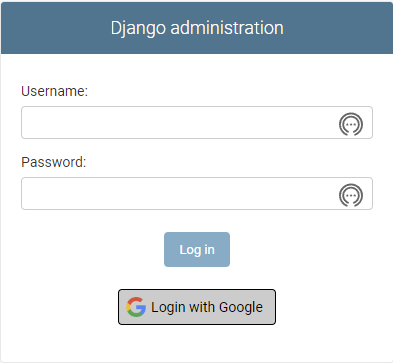

<p align="center">
  
</p>

[](https://pypi.org/project/django-google-sso/)
[](https://github.com/chrismaille/django-google-sso/actions)
[](https://www.python.org)
[](https://www.djangoproject.com/)
[](https://conventionalcommits.org)
[](https://github.com/psf/black)
[](https://github.com/pre-commit/pre-commit)

## Welcome to Django Google SSO

This library aims to simplify the process of authenticating users with Google in Django Admin pages,
inspired by libraries like [django_microsoft_auth](https://github.com/AngellusMortis/django_microsoft_auth)
and [django-admin-sso](https://github.com/matthiask/django-admin-sso/)

---

### Documentation

* Docs: https://chrismaille.github.io/django-google-sso/

---

### Install

```shell
$ pip install django-google-sso
```

### Configure

1. Add the following to your `settings.py` `INSTALLED_APPS`:

```python
# settings.py

INSTALLED_APPS = [
    # other django apps
    "django.contrib.messages",  # Need for Auth messages
    "django_google_sso",  # Add django_google_sso
]
```

2. In [Google Console](https://console.cloud.google.com/apis/credentials) at _Api -> Credentials_, retrieve your
   Project Credentials and add them in your `settings.py`:

```python
# settings.py

GOOGLE_SSO_CLIENT_ID = "your client id here"
GOOGLE_SSO_PROJECT_ID = "your project id here"
GOOGLE_SSO_CLIENT_SECRET = "your client secret here"
```

3. Add the callback uri `http://localhost:8000/google_sso/callback/` in your Google Console, on the "Authorized Redirect URL".

4. Let Django Google SSO auto create users for allowable domains:

```python
# settings.py

GOOGLE_SSO_ALLOWABLE_DOMAINS = ["example.com"]
```

5. In `urls.py` please add the **Django-Google-SSO** views:

```python
# urls.py

from django.urls import include, path

urlpatterns = [
    # other urlpatterns...
    path(
        "google_sso/", include("django_google_sso.urls", namespace="django_google_sso")
    ),
]
```
6. And run migrations:

```shell
$ python manage.py migrate
```

That's it. Start django on port 8000 and open your browser in `http://localhost:8000/admin/login` and you should see the Google SSO button.



---

## License

This project is licensed under the terms of the MIT license.
