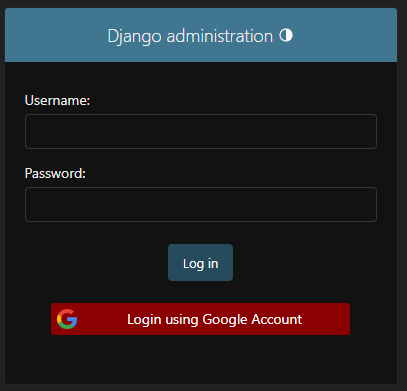

# Customizing the Login Page
Below, you can find some tips on how to customize the login page.

## Hiding the Login Form

If you want to show only the Google Login button, you can hide the login form using
the `GOOGLE_SSO_SHOW_FORM_ON_ADMIN_PAGE` setting.

```python
# settings.py

GOOGLE_SSO_SHOW_FORM_ON_ADMIN_PAGE = False
```

## Customizing the Login button

Customizing the Login button is very simple. For the logo and text change is straightforward, just inform the new
values. For
the style, you can override the css file.

### The button logo

To change the logo, use the `GOOGLE_SSO_BUTTON_LOGO` setting.

```python
# settings.py
GOOGLE_SSO_LOGO_URL = "https://example.com/logo.png"
```

### The button text

To change the text, use the `GOOGLE_SSO_BUTTON_TEXT` setting.

```python
# settings.py

GOOGLE_SSO_TEXT = "New login message"
```

### The button style

The login button css style is located at
`static/django_google_sso/google_button.css`. You can override this file as per Django
[static files documentation](https://docs.djangoproject.com/en/4.2/howto/static-files/).

#### An example

```python
# settings.py

GOOGLE_SSO_TEXT = "Login using Google Account"
```

```css
/* static/django_google_sso/google_button.css */

/* other css... */

.google-login-btn {
    background-color: red;
    border-radius: 3px;
    padding: 2px;
    margin-bottom: 10px;
    width: 100%;
}
```

The result:


