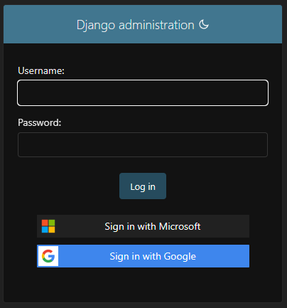

# Using Multiple Social Logins

A special advanced case is when you need to log in from multiple social providers. In this case, each provider will have its own
package which you need to install and configure. Currently, we support:

* [Django Google SSO](https://github.com/megalus/django-google-sso)
* [Django Microsoft SSO](https://github.com/megalus/django-microsoft-sso)
* [Django GitHub SSO](https://github.com/megalus/django-github-sso)

## Install the Packages
Install the packages you need:

```bash
pip install django-google-sso django-microsoft-sso django-github-sso

# Optionally install Stela to handle .env files
pip install stela
```

## Add Package to Django Project
To add this package in your Django Project, please modify the `INSTALLED_APPS` in your `settings.py`:

```python
# settings.py

INSTALLED_APPS = [
    # other django apps
    "django.contrib.messages",  # Need for Auth messages
    "django_github_sso",  # Will show as first button in login page
    "django_google_sso",
    "django_microsoft_sso",
]
```

!!! tip "Order matters"
    The first package on list will be the first button in the login page.

## Add secrets to env file

```bash
# .env.local
GOOGLE_SSO_CLIENT_ID=999999999999-xxxxxxxxx.apps.googleusercontent.com
GOOGLE_SSO_CLIENT_SECRET=xxxxxx
GOOGLE_SSO_PROJECT_ID=999999999999

MICROSOFT_SSO_APPLICATION_ID=FOO
MICROSOFT_SSO_CLIENT_SECRET=BAZ

GITHUB_SSO_CLIENT_ID=BAR
GITHUB_SSO_CLIENT_SECRET=FOOBAR
```

### Setup Django URLs
Add the URLs of each provider to your `urls.py` file:

```python
from django.urls import include, path


urlpatterns += [
    path(
        "github_sso/",
        include("django_google_sso.urls", namespace="django_github_sso"),
    ),
    path(
        "google_sso/",
        include("django_github_sso.urls", namespace="django_google_sso"),
    ),
        path(
        "microsoft_sso/",
        include("django_github_sso.urls", namespace="django_microsoft_sso"),
    ),
]
```

### Setup Django Settings
Add the settings of each provider to your `settings.py` file:

```python
# settings.py
from stela import env

# Django Microsoft SSO
MICROSOFT_SSO_ENABLED = True
MICROSOFT_SSO_APPLICATION_ID = env.MICROSOFT_SSO_APPLICATION_ID
MICROSOFT_SSO_CLIENT_SECRET = env.MICROSOFT_SSO_CLIENT_SECRET
MICROSOFT_SSO_ALLOWABLE_DOMAINS = ["contoso.com"]

# Django Google SSO
GOOGLE_SSO_ENABLED = True
GOOGLE_SSO_CLIENT_ID = env.GOOGLE_SSO_CLIENT_ID
GOOGLE_SSO_PROJECT_ID = env.GOOGLE_SSO_PROJECT_ID
GOOGLE_SSO_CLIENT_SECRET = env.GOOGLE_SSO_CLIENT_SECRET
GOOGLE_SSO_ALLOWABLE_DOMAINS = ["contoso.net"]

# Django GitHub SSO
GITHUB_SSO_ENABLED = True
GITHUB_SSO_CLIENT_ID = env.GITHUB_SSO_CLIENT_ID
GITHUB_SSO_CLIENT_SECRET = env.GITHUB_SSO_CLIENT_SECRET
GITHUB_SSO_ALLOWABLE_ORGANIZATIONS = ["contoso"]
```

The login page will look like this:



!!! tip "You can hide the login form"
    If you want to show only the SSO buttons, you can hide the login form using the `SSO_SHOW_FORM_ON_ADMIN_PAGE` setting.

    ```python
    # settings.py

    SSO_SHOW_FORM_ON_ADMIN_PAGE = False
    ```

## Avoiding duplicated Users
Both **Django GitHub SSO** and **Django Microsoft SSO** can create users without an email address, comparing the User `username`
field against the _Azure User Principal Name_ or _Github User Name_. This can cause duplicated users if you are using either package.

To avoid this, you can set the `MICROSOFT_SSO_UNIQUE_EMAIL` and `GITHUB_SSO_UNIQUE_EMAIL` settings to `True`,
making these packages compare User `email` against _Azure Mail_ field or _Github Primary Email_. Make sure your Azure Tenant
and GitHub Organization users have registered emails.

## The Django E003/W003 Warning
If you are using multiple **Django SSO** projects, you will get a warning like this:

```
WARNINGS:
?: (templates.E003) 'show_form' is used for multiple template tag modules: 'django_google_sso.templatetags.show_form', 'django_microsoft_sso.templatetags.show_form'
?: (templates.E003) 'sso_tags' is used for multiple template tag modules: 'django_google_sso.templatetags.sso_tags', 'django_microsoft_sso.templatetags.sso_tags'
```

This is because both packages use the same template tags. To silence this warning, you can set the `SILENCED_SYSTEM_CHECKS` as per Django documentation:

```python
# settings.py
SILENCED_SYSTEM_CHECKS = ["templates.W003"] # Or "templates.E003" for Django <=5.0
```

But if you need to check the templates, you can use the `SSO_USE_ALTERNATE_W003` setting to use an alternate template tag. This alternate check will
run the original check, but will not raise the warning for the Django SSO packages. To use this alternate check, you need to set both the Django Silence Check and `SSO_USE_ALTERNATE_W003`:

```python
# settings.py

SILENCED_SYSTEM_CHECKS = ["templates.W003"]  # Will silence the original check
SSO_USE_ALTERNATE_W003 = True  # Will run alternate check
```

!!! warning "The tags will be executed only once, per request, for the **last** installed package"
    To avoid multiple executions for the `define_sso_providers` and `define_show_form` tags, these code will be executed once and the result will be cached on the request object.
    Due to django template loading mechanism, the tag's code from the **last** installed package will be the one executed. This means if you have
    multiple packages installed, only the last one will be executed. To avoid this, you can use the `sso_providers` and `show_admin_form` context variables
    to pass the values you want to show in the template.

    ```python
    # views.py
    from django.shortcuts import render
    from django_google_sso.template_tags import define_sso_providers, define_show_form

    def my_login_view(request):
        ...
        sso_providers = define_sso_providers({"context": request})
        show_admin_form = define_show_form({"context": request})

        return render(
            request,
            "my_login_template.html",
            {"sso_providers": sso_providers, "show_admin_form": show_admin_form},
        )
    ```

## Split Providers between Admin and Page Logins

If you want to use different providers for Admin and Page logins, you may need to enable/disable providers per request. For example, suppose if you want to use
all Django SSOs for Page login but only **Django Google SSO** for the Admin, you can add the respective
`*_SSO_PAGES_ENABLED` and `*_SSO_ADMIN_ENABLED`, like this:

```python
# settings.py

# Enable or Disable globally (both Admin and Pages):
GOOGLE_SSO_ENABLED = True
MICROSOFT_SSO_ENABLED = True
GITHUB_SSO_ENABLED = True

# Enable or disable per request path:
MICROSOFT_SSO_ADMIN_ENABLED = False
MICROSOFT_SSO_PAGES_ENABLED = True
GITHUB_SSO_ADMIN_ENABLED = False
GITHUB_SSO_PAGES_ENABLED = True
```
!!! warning "You need to be explicit on these settings"
    If you set `GOOGLE_SSO_ADMIN_ENABLED = False` and do not set `GOOGLE_SSO_PAGES_ENABLED`, the default value for `GOOGLE_SSO_PAGES_ENABLED` is also `False`.
    This means Google SSO will be disabled for both Admin and Page logins. You need to be explicit on these settings.
