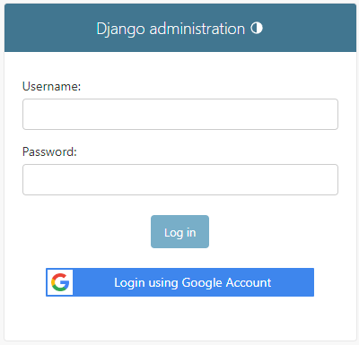
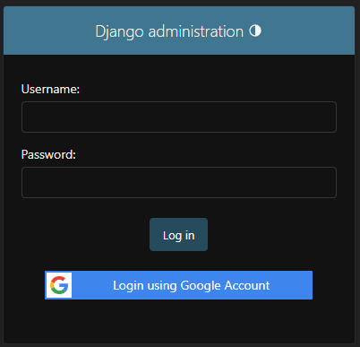

# Quick Setup

## Setup Django Settings

To add this package in your Django Project, please modify the `INSTALLED_APPS` in your `settings.py`:

```python
# settings.py

INSTALLED_APPS = [
    # other django apps
    "django.contrib.messages",  # Need for Auth messages
    "django_google_sso",  # Add django_google_sso
]
```

## Setup Google Credentials

Now, add your [Google Project Web App API Credentials](https://console.cloud.google.com/apis/credentials) in your `settings.py`:

```python
# settings.py

GOOGLE_SSO_CLIENT_ID = "your Web App Client Id here"
GOOGLE_SSO_CLIENT_SECRET = "your Web App Client Secret here"
GOOGLE_SSO_PROJECT_ID = "your Google Project Id here"
```

## Setup Callback URI

In [Google Console](https://console.cloud.google.com/apis/credentials) at _Api -> Credentials -> Oauth2 Client_,
add the following _Authorized Redirect URI_: `https://your-domain.com/google_sso/callback/` replacing `your-domain.com` with your
real domain (and Port). For example, if you're running locally, you can use `http://localhost:8000/google_sso/callback/`.

!!! tip "Do not forget the trailing slash!"

## Setup Auto-Create Users

The next option is to set up the auto-create users from Django Google SSO. Only emails with the allowed domains will be
created automatically. If the email is not in the allowed domains, the user will be redirected to the login page.

```python
# settings.py

GOOGLE_SSO_ALLOWABLE_DOMAINS = ["your-domain.com"]
```

## Setup Django URLs

And in your `urls.py` please add the **Django-Google-SSO** views:

```python
# urls.py

from django.urls import include, path

urlpatterns = [
    # other urlpatterns...
    path(
        "google_sso/", include(
            "django_google_sso.urls",
            namespace="django_google_sso"
        )
    ),
]
```

## Run Django migrations

Finally, run migrations

```shell
$ python manage.py migrate
```

---

And, that's it: **Django Google SSO** is ready for use. When you open the admin page, you will see the "Login with Google" button:

=== "Light Mode"
    

=== "Dark Mode"
    

??? question "How about Django Admin skins, like Grappelli?"
    **Django Google SSO** will works with any Django Admin skin which calls the original Django login template, like
    [Grappelli](https://github.com/sehmaschine/django-grappelli), [Django Jazzmin](https://github.com/farridav/django-jazzmin),
    [Django Admin Interface](https://github.com/fabiocaccamo/django-admin-interface) and [Django Jet Reboot](https://github.com/assem-ch/django-jet-reboot).

    If the skin uses his own login template, the "Login with Google" button will not be displayed.

---

For the next pages, let's see each one of these steps with more details.
